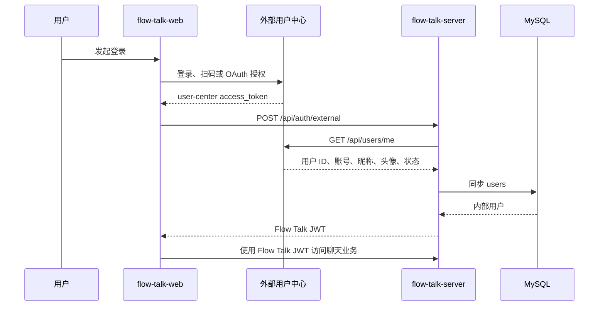

# Flow Talk 外部身份系统完整接入指南

本文说明如何把现有的 `demo` 外部登录扩展为真实的用户中心、企业 SSO 或 OAuth 身份系统接入。示例统一把外部系统命名为 `user-center`，并假设它能通过 Bearer Token 返回当前用户资料。

本文只要求修改认证边界，不改动会话、消息、群成员、设备和 WebSocket 的身份模型。外部用户进入 Flow Talk 后仍然会映射成内部 `users.id`，后续业务统一使用 Flow Talk JWT。

> 文中的代码示例均逐行附有注释。示例用于说明完整落地方式，正式合并前仍应结合真实用户中心的协议、字段和错误码调整。

## 一、当前预留能力

项目已经具备以下扩展点：

| 文件 | 已有能力 |
| --- | --- |
| [`models/auth_provider.go`](../models/auth_provider.go) | 定义 `TokenVerifier` 接口和 `ExternalUserProfile` |
| [`models/external_user_model.go`](../models/external_user_model.go) | 校验外部 Token、同步内部用户、检查内部禁用状态 |
| [`controllers/external_auth_controller.go`](../controllers/external_auth_controller.go) | 提供 `POST /api/auth/external` 并签发 Flow Talk JWT |
| [`middlewares/auth.go`](../middlewares/auth.go) | 后续业务接口统一验证 Flow Talk JWT |
| [`flow-talk-web`](../../flow-talk-web) | 登录页已经能调用外部登录接口，但当前 provider 固定为 `demo` |

当前链路依次为：前端提交 `provider + access_token`，进入 `ExternalAuthController.Login`，随后调用 `LoginExternalUser`、`verifierForProvider`、`TokenVerifier.Verify`、`SyncExternalUser` 和 `GenerateToken`，最后返回内部用户与 Flow Talk JWT。

真实接入的核心工作只有三项：

1. 实现真实的 `TokenVerifier`。
2. 把 verifier 注册为服务端白名单 provider。
3. 让前端先从真实身份系统获得 access token，再调用 `/api/auth/external` 换取 Flow Talk JWT。

## 二、目标架构



### 两类 Token 的边界

| Token | 签发方 | 使用位置 | 是否保存到 Flow Talk 数据库 |
| --- | --- | --- | --- |
| 外部 `access_token` | 用户中心/SSO/OAuth 平台 | 仅用于 `/api/auth/external` 换票及服务端向外部系统验票 | 否 |
| Flow Talk JWT | `flow-talk-server` | 会话、消息、资源、设备和 WebSocket | 否，前端本地保存 |

## 三、外部用户中心必须提供的接口

本文假设外部系统提供以下接口：

| 项目 | 约定 |
| --- | --- |
| 方法 | `GET` |
| 路径 | `/api/users/me` |
| 鉴权 | `Authorization: Bearer <user-center-access-token>` |
| 成功状态 | `200` |
| 无效或过期 Token | `401` |
| 用户禁用 | `403`，或响应资料中的状态不是 `enabled` |
| 用户中心异常 | `5xx` |

成功响应必须至少能映射出以下字段：

| 外部字段 | 必填 | Flow Talk 用途 |
| --- | --- | --- |
| `id` | 是 | 组成稳定 `external_id`，永远不能使用可变昵称代替 |
| `username` | 建议 | 写入内部 `users.username` |
| `nickname` | 否 | 聊天界面展示名，缺失时回退到 username |
| `avatar_url` | 否 | 头像 URL |
| `status` | 是 | 只有 `enabled` 用户可以登录 |

不要让前端直接把上述资料提交给 Flow Talk。Flow Talk 必须使用 access token 从外部系统服务端获取可信资料。

## 四、第一步：增加外部身份配置

### 4.1 `conf/app.ini`

在 [`conf/app.ini`](../conf/app.ini) 中增加配置段：

```ini
; 控制真实用户中心 provider 是否启用。
[auth_provider.user_center]
; 本地开发可先关闭，配置完成后改为 true。
enabled = false
; 固定的用户中心服务地址，不能由前端传入。
base_url = https://user-center.example.com
; 服务端验票请求超时时间，使用 Go duration 格式。
timeout = 5s
```

生产环境中的域名、证书和网络策略应由部署系统管理。不要把 access token、客户端密钥或用户密码写进仓库中的 `app.ini`。

### 4.2 在 `models/database.go` 增加配置结构

把下面结构加入 [`models/database.go`](../models/database.go)：

```go
// ExternalAuthConfig 保存所有外部身份提供方的配置。
type ExternalAuthConfig struct { // 定义外部认证总配置结构。
	UserCenter UserCenterAuthConfig // 保存 user-center provider 的配置。
} // 结束外部认证总配置结构。

// UserCenterAuthConfig 保存真实用户中心的连接配置。
type UserCenterAuthConfig struct { // 定义用户中心配置结构。
	Enabled bool // 控制 provider 是否启用。
	BaseURL string // 保存固定的用户中心根地址。
	Timeout time.Duration // 保存服务端验票请求超时时间。
} // 结束用户中心配置结构。
```

在 `AppConfig` 中增加字段：

```go
ExternalAuth ExternalAuthConfig // 把外部认证配置纳入应用总配置。
```

在 `LoadConfig` 读取 section 的位置增加：

```go
userCenterSection := file.Section("auth_provider.user_center") // 读取用户中心配置段。
```

在组装 `AppConfig` 时增加：

```go
ExternalAuth: ExternalAuthConfig{ // 开始组装外部认证配置。
	UserCenter: UserCenterAuthConfig{ // 开始组装用户中心配置。
		Enabled: userCenterSection.Key("enabled").MustBool(false), // 读取是否启用，默认关闭。
		BaseURL: strings.TrimSpace(userCenterSection.Key("base_url").String()), // 读取并清理根地址。
	}, // 结束用户中心配置组装。
}, // 结束外部认证配置组装。
```

在 `LoadConfig` 返回前解析并校验 timeout：

```go
cfg.ExternalAuth.UserCenter.Timeout, err = time.ParseDuration( // 把字符串 timeout 转成 time.Duration。
	strings.TrimSpace(userCenterSection.Key("timeout").MustString("5s")), // 读取 timeout，并提供 5 秒默认值。
) // 结束 ParseDuration 调用。
if err != nil || cfg.ExternalAuth.UserCenter.Timeout <= 0 { // 拒绝无法解析或非正数的 timeout。
	return AppConfig{}, fmt.Errorf("auth_provider.user_center.timeout 必须是有效的正数时间，例如 5s") // 返回明确配置错误。
} // 结束 timeout 校验。
if cfg.ExternalAuth.UserCenter.Enabled && cfg.ExternalAuth.UserCenter.BaseURL == "" { // 启用时必须配置固定根地址。
	return AppConfig{}, fmt.Errorf("auth_provider.user_center.base_url 不能为空") // 返回缺少地址错误。
} // 结束根地址校验。
```

在 `LogFields` 中只输出非敏感配置：

```go
"external_auth": map[string]any{ // 增加外部认证日志分组。
	"user_center": map[string]any{ // 增加用户中心日志分组。
		"enabled": cfg.ExternalAuth.UserCenter.Enabled, // 输出是否启用。
		"base_url": cfg.ExternalAuth.UserCenter.BaseURL, // 输出请求目标，便于排查环境错误。
		"timeout": cfg.ExternalAuth.UserCenter.Timeout.String(), // 输出最终超时时间。
	}, // 结束用户中心日志字段。
}, // 结束外部认证日志字段。
```

日志中禁止输出外部 access token、Flow Talk JWT 或未来可能增加的客户端密钥。

## 五、第二步：增加可注册的 Provider 白名单

当前 `verifierForProvider` 使用 `switch`。真实 provider 增多后，建议改为只允许服务端主动注册的线程安全白名单。

在 [`models/auth_provider.go`](../models/auth_provider.go) 的 import 中增加 `sync`，并加入以下错误和注册表：

```go
var ( // 开始声明外部认证领域错误。
	ErrUnsupportedAuthProvider = errors.New("不支持的外部身份提供方") // 表示 provider 没有被服务端注册。
	ErrExternalTokenInvalid = errors.New("外部身份令牌无效") // 表示外部 token 缺失、过期或无效。
	ErrExternalAuthUnavailable = errors.New("外部身份服务暂不可用") // 表示用户中心超时或服务异常。
) // 结束领域错误声明。

var tokenVerifierRegistry = map[string]TokenVerifier{ // 创建服务端维护的 provider 白名单。
	"demo": DemoTokenVerifier{}, // 保留本地开发使用的 demo provider。
} // 结束默认注册表。

var tokenVerifierRegistryMu sync.RWMutex // 保护 provider 注册表的并发读写。
```

增加注册函数，并用它替换原来的 `switch`：

```go
// RegisterTokenVerifier 注册一个由服务端配置决定的外部身份校验器。
func RegisterTokenVerifier(name string, verifier TokenVerifier) error { // 定义 provider 注册函数。
	name = strings.TrimSpace(name) // 清理 provider 名称两侧空格。
	if name == "" || verifier == nil { // provider 名称和校验器都必须有效。
		return ErrValidation // 返回统一参数校验错误。
	} // 结束注册参数校验。
	tokenVerifierRegistryMu.Lock() // 获取写锁，避免并发修改 map。
	defer tokenVerifierRegistryMu.Unlock() // 函数结束时释放写锁。
	tokenVerifierRegistry[name] = verifier // 写入或覆盖指定 provider。
	return nil // 返回注册成功。
} // 结束 provider 注册函数。

// verifierForProvider 只从服务端白名单中选择校验器。
func verifierForProvider(provider string) (TokenVerifier, error) { // 定义 provider 查询函数。
	provider = strings.TrimSpace(provider) // 清理客户端传入的 provider 名称。
	tokenVerifierRegistryMu.RLock() // 获取读锁，允许多个登录请求并发查询。
	verifier, exists := tokenVerifierRegistry[provider] // 从白名单读取校验器。
	tokenVerifierRegistryMu.RUnlock() // 查询完成后立即释放读锁。
	if !exists { // 不存在表示 provider 未启用或不受支持。
		return nil, ErrUnsupportedAuthProvider // 返回不支持的 provider 错误。
	} // 结束存在性判断。
	return verifier, nil // 返回服务端注册的校验器。
} // 结束 provider 查询函数。
```

不要根据客户端传入的 URL 动态创建 verifier。客户端只能提交短名称，例如 `user-center`；真实目标地址必须来自服务端配置。

## 六、第三步：实现真实用户中心校验器

新增文件 `models/user_center_auth_provider.go`。下面给出一个完整实现，假设用户中心直接返回当前用户 JSON。

```go
package models // 声明该文件属于 models 包。

import ( // 开始导入依赖。
	"encoding/json" // 用于解析用户中心返回的 JSON。
	"fmt" // 用于给底层错误增加上下文。
	"io" // 用于限制响应体读取大小。
	"net/http" // 用于调用用户中心 HTTP 接口。
	"net/url" // 用于安全解析和拼接固定服务地址。
	"strings" // 用于清理 token 和用户字段。
	"time" // 用于配置 HTTP 客户端超时。
) // 结束依赖导入。

const maxUserCenterResponseBytes int64 = 1 << 20 // 把用户资料响应限制为 1 MiB。

// UserCenterTokenVerifier 负责向真实用户中心验证 access token。
type UserCenterTokenVerifier struct { // 定义用户中心校验器。
	profileURL string // 保存固定的当前用户接口地址。
	client *http.Client // 保存带超时的可复用 HTTP 客户端。
} // 结束用户中心校验器定义。

// userCenterProfile 是用户中心当前用户接口的响应结构。
type userCenterProfile struct { // 定义外部用户资料结构。
	ID string `json:"id"` // 接收稳定且不可变的外部用户 ID。
	Username string `json:"username"` // 接收外部登录账号。
	Nickname string `json:"nickname"` // 接收外部展示昵称。
	AvatarURL string `json:"avatar_url"` // 接收外部头像 URL。
	Status string `json:"status"` // 接收 enabled/disabled 等状态。
} // 结束外部用户资料结构。

// NewUserCenterTokenVerifier 创建并校验用户中心 verifier 配置。
func NewUserCenterTokenVerifier(cfg UserCenterAuthConfig) (*UserCenterTokenVerifier, error) { // 定义构造函数。
	baseURL, err := url.Parse(strings.TrimSpace(cfg.BaseURL)) // 解析服务端配置的固定根地址。
	if err != nil || baseURL.Scheme == "" || baseURL.Host == "" { // 拒绝非法或缺少主机的地址。
		return nil, fmt.Errorf("用户中心 base_url 不合法") // 返回启动阶段配置错误。
	} // 结束地址合法性判断。
	if baseURL.Scheme != "https" && baseURL.Scheme != "http" { // 只接受标准 HTTP 协议。
		return nil, fmt.Errorf("用户中心 base_url 只支持 http 或 https") // 拒绝 file 等危险协议。
	} // 结束协议白名单判断。
	if cfg.Timeout <= 0 { // 超时时间必须为正数。
		return nil, fmt.Errorf("用户中心 timeout 必须大于 0") // 返回配置错误。
	} // 结束超时时间校验。
	profileURL := baseURL.ResolveReference(&url.URL{Path: "/api/users/me"}) // 使用固定路径构造用户资料接口。
	return &UserCenterTokenVerifier{ // 返回初始化完成的 verifier。
		profileURL: profileURL.String(), // 保存最终用户资料接口地址。
		client: &http.Client{Timeout: cfg.Timeout}, // 创建带整体超时的 HTTP 客户端。
	}, nil // 返回 verifier 和空错误。
} // 结束构造函数。

// Verify 调用用户中心验证 token，并转换成 Flow Talk 统一资料。
func (v *UserCenterTokenVerifier) Verify(accessToken string) (ExternalUserProfile, error) { // 实现 TokenVerifier 接口。
	accessToken = strings.TrimSpace(accessToken) // 清理 token 两侧空格。
	if accessToken == "" { // 空 token 不需要发送外部请求。
		return ExternalUserProfile{}, ErrExternalTokenInvalid // 返回外部 token 无效。
	} // 结束空 token 判断。
	req, err := http.NewRequest(http.MethodGet, v.profileURL, nil) // 创建只读用户资料请求。
	if err != nil { // 理论上构造函数已校验 URL，这里仍处理错误。
		return ExternalUserProfile{}, fmt.Errorf("创建用户中心请求失败: %w", err) // 包装请求创建错误。
	} // 结束请求创建错误处理。
	req.Header.Set("Authorization", "Bearer "+accessToken) // 按 Bearer 规范传递外部 token。
	req.Header.Set("Accept", "application/json") // 明确要求 JSON 响应。
	resp, err := v.client.Do(req) // 使用带超时的客户端执行请求。
	if err != nil { // 网络错误、DNS 错误和超时都会进入这里。
		return ExternalUserProfile{}, fmt.Errorf("%w: %v", ErrExternalAuthUnavailable, err) // 转成外部服务不可用错误。
	} // 结束请求错误处理。
	defer resp.Body.Close() // 确保响应体被关闭并释放连接资源。
	if resp.StatusCode == http.StatusUnauthorized { // 用户中心 401 表示 token 无效或过期。
		return ExternalUserProfile{}, ErrExternalTokenInvalid // 返回稳定的无效 token 错误。
	} // 结束 401 处理。
	if resp.StatusCode == http.StatusForbidden { // 用户中心 403 表示用户被禁用或无权登录。
		return ExternalUserProfile{}, ErrUserDisabled // 复用内部用户禁用错误。
	} // 结束 403 处理。
	if resp.StatusCode < http.StatusOK || resp.StatusCode >= http.StatusMultipleChoices { // 其它非 2xx 都视为上游异常。
		return ExternalUserProfile{}, fmt.Errorf("%w: status=%d", ErrExternalAuthUnavailable, resp.StatusCode) // 返回服务不可用并记录状态码。
	} // 结束非成功状态处理。
	decoder := json.NewDecoder(io.LimitReader(resp.Body, maxUserCenterResponseBytes)) // 限制响应大小后创建 JSON 解码器。
	var profile userCenterProfile // 声明接收外部资料的变量。
	if err := decoder.Decode(&profile); err != nil { // 解析用户中心返回的 JSON。
		return ExternalUserProfile{}, fmt.Errorf("%w: 用户资料解析失败", ErrExternalAuthUnavailable) // 隐藏原始响应内容并返回稳定错误。
	} // 结束 JSON 解析错误处理。
	profile.ID = strings.TrimSpace(profile.ID) // 清理外部稳定 ID。
	profile.Username = strings.TrimSpace(profile.Username) // 清理外部账号。
	profile.Nickname = strings.TrimSpace(profile.Nickname) // 清理外部昵称。
	profile.AvatarURL = strings.TrimSpace(profile.AvatarURL) // 清理外部头像地址。
	profile.Status = strings.TrimSpace(profile.Status) // 清理外部状态。
	if profile.ID == "" || profile.Username == "" { // 稳定 ID 和账号是最低必填字段。
		return ExternalUserProfile{}, fmt.Errorf("%w: 用户资料缺少 id 或 username", ErrExternalAuthUnavailable) // 把错误归为上游数据异常。
	} // 结束必填字段判断。
	if profile.Status != "enabled" { // 只有明确启用的外部用户才能登录。
		return ExternalUserProfile{}, ErrUserDisabled // 返回用户禁用错误。
	} // 结束用户状态判断。
	return ExternalUserProfile{ // 转成 Flow Talk 已有的统一外部用户资料。
		ExternalID: "user-center:" + profile.ID, // 加 provider 前缀，避免多身份源 ID 冲突。
		Username: profile.Username, // 使用用户中心账号作为内部账号初始值。
		Nickname: profile.Nickname, // 使用用户中心昵称作为展示名。
		AvatarURL: profile.AvatarURL, // 同步用户中心头像地址。
	}, nil // 返回验证成功的用户资料。
} // 结束 Verify 实现。
```

### 响应包裹格式

如果真实用户中心返回 `{code, data, message}`，只需增加一个响应信封结构，并把解码目标改成信封。不要为了兼容多种未知结构而使用大量 `map[string]any`；外部协议应当明确并可测试。

## 七、第四步：启动时注册真实 Provider

在 [`main.go`](../main.go) 读取配置成功后、注册路由之前增加：

```go
if cfg.ExternalAuth.UserCenter.Enabled { // 只在配置启用时注册真实 provider。
	verifier, err := models.NewUserCenterTokenVerifier(cfg.ExternalAuth.UserCenter) // 根据固定配置创建校验器。
	if err != nil { // 配置错误时不能带病启动。
		log.Fatalf("初始化 user-center provider 失败: %v", err) // 输出脱敏错误并终止进程。
	} // 结束构造错误处理。
	if err := models.RegisterTokenVerifier("user-center", verifier); err != nil { // 把 verifier 注册进服务端白名单。
		log.Fatalf("注册 user-center provider 失败: %v", err) // 注册失败时终止启动。
	} // 结束注册错误处理。
} // 结束 provider 启用判断。
```

这样 `router.go` 不需要理解具体身份平台；`ExternalAuthController` 继续通过 `LoginExternalUser` 使用统一接口。

## 八、第五步：完善 HTTP 错误映射

在 [`controllers/external_auth_controller.go`](../controllers/external_auth_controller.go) 的 `writeExternalAuthError` 中增加两类真实外部错误：

```go
case errors.Is(err, models.ErrExternalTokenInvalid): // 外部 token 无效或过期。
	responses.Error(c, http.StatusUnauthorized, "外部登录已失效，请重新登录") // 要求客户端回到外部登录流程。
case errors.Is(err, models.ErrExternalAuthUnavailable): // 用户中心超时或服务异常。
	responses.Error(c, http.StatusServiceUnavailable, "外部身份服务暂不可用") // 返回 503，提示稍后重试。
```

不要把用户中心返回的响应体、SQL 错误或完整网络错误直接返回给浏览器。服务端日志只记录排障所需的状态码、目标服务和请求耗时，不能记录 Token。

## 九、第六步：前端获取 Token 并换取 Flow Talk JWT

当前 [`use-login-form-hook.ts`](../../flow-talk-web/app/pages/login/hooks/use-login-form-hook.ts) 固定提交 `provider: "demo"`。真实接入后，前端应该先从用户中心登录流程获得 access token，再调用现有 API 封装。

下面函数展示“已经获得用户中心 access token”之后的换票步骤：

```ts
async function exchangeUserCenterToken(accessToken: string): Promise<void> { // 定义外部 token 换票函数。
  const normalizedToken = accessToken.trim(); // 清理 token 两侧空格。
  if (!normalizedToken) { // 防止空 token 请求服务端。
    throw new Error("缺少用户中心 access token"); // 返回前端流程错误。
  } // 结束空 token 判断。
  const response = await dataExternalLogin({ // 调用现有 Flow Talk 外部登录接口封装。
    access_token: normalizedToken, // 传递用户中心签发的 token。
    provider: "user-center" // 使用服务端白名单中的固定 provider 名称。
  }); // 结束外部登录请求。
  saveSession(response); // 保存 Flow Talk 返回的内部用户和 IM JWT。
  window.location.replace("/"); // 用 Flow Talk 登录态进入聊天工作台。
} // 结束换票函数。
```

### 前端获取外部 Token 的推荐方式

具体方式由用户中心决定：

- 企业内部系统：前端调用已有登录 API，成功响应中获得短期 access token。
- OAuth/OIDC：使用 Authorization Code + PKCE；前端拿授权码后通过可信后端换 Token。
- 同域单点登录：后端读取 HttpOnly SSO Cookie，再由后端完成换票。

不要把 access token 放进 URL 查询参数。URL 可能进入浏览器历史、代理日志、Referer 和监控系统。

生产版本应删除或隐藏手工输入“外部身份令牌”的输入框。手工 Token 输入只适合本地 demo 联调。

## 十、内部用户同步规则

现有 [`SyncExternalUser`](../models/external_user_model.go) 已经负责：

1. 使用 `external_id` 查找内部用户。
2. 已存在时刷新昵称和头像。
3. 不存在时创建 `auth_source = external` 的用户。
4. 保留稳定的内部 `users.id`。
5. 拒绝被 Flow Talk 内部禁用的用户继续换取 JWT。

### 必须保持稳定的字段

| 字段 | 原因 |
| --- | --- |
| 外部系统 `id` | 用于构造 `external_id`，关联不能随昵称、邮箱或手机号变化 |
| Flow Talk `users.id` | 历史消息、会话成员、设备和回执都依赖它 |
| provider 前缀 | 防止不同身份平台恰好使用相同用户 ID |

### Username 冲突策略

`users.username` 当前有唯一约束。真实系统可能出现本地账号与外部账号重名，建议在 verifier 中统一增加 provider 前缀：

```go
Username: "uc_" + profile.Username, // 给用户中心账号增加命名空间，降低唯一键冲突概率。
```

如果产品要求保留原始账号展示，应新增独立展示字段，而不是取消数据库唯一约束。

### 外部禁用状态

当前 `SyncExternalUser` 不会用外部资料覆盖内部 `status`。推荐把两类禁用语义分开：

- 外部用户中心禁用：verifier 直接返回 `ErrUserDisabled`，不签发新 JWT。
- Flow Talk 内部禁用：`LoginExternalUser` 在同步后检查内部 `user.Status`。

这样任意一侧禁用都能阻止新登录，同时不会让外部同步意外解除内部风控禁用。

## 十一、单元测试示例

建议使用 `httptest.Server` 模拟用户中心，至少覆盖成功、401、403、5xx、超时和错误 JSON。

新增 `models/user_center_auth_provider_test.go`，下面给出成功场景示例：

```go
package models // 声明测试属于 models 包，便于访问包内实现。

import ( // 开始导入测试依赖。
	"net/http" // 用于构造模拟 HTTP 响应。
	"net/http/httptest" // 用于启动本地模拟用户中心。
	"testing" // 使用 Go 标准测试框架。
	"time" // 用于配置很短的测试超时。
) // 结束测试依赖导入。

func TestUserCenterTokenVerifierVerify(t *testing.T) { // 定义成功验票测试。
	server := httptest.NewServer(http.HandlerFunc(func(w http.ResponseWriter, r *http.Request) { // 启动模拟用户中心。
		if got := r.Header.Get("Authorization"); got != "Bearer valid-token" { // 校验 verifier 是否正确传递 Bearer Token。
			t.Fatalf("unexpected authorization header: %s", got) // Header 不符合预期时立即失败。
		} // 结束 Authorization 判断。
		w.Header().Set("Content-Type", "application/json") // 告诉客户端响应为 JSON。
		w.WriteHeader(http.StatusOK) // 返回成功状态码。
		_, _ = w.Write([]byte(`{"id":"10001","username":"alice","nickname":"Alice","avatar_url":"https://example.com/a.png","status":"enabled"}`)) // 返回可信用户资料。
	})) // 结束模拟服务器创建。
	defer server.Close() // 测试结束时关闭模拟服务器。
	verifier, err := NewUserCenterTokenVerifier(UserCenterAuthConfig{ // 使用模拟地址创建 verifier。
		BaseURL: server.URL, // 指向本地模拟用户中心。
		Timeout: time.Second, // 设置 1 秒测试超时。
	}) // 结束 verifier 配置。
	if err != nil { // 构造 verifier 不应失败。
		t.Fatalf("create verifier: %v", err) // 输出构造错误并终止测试。
	} // 结束构造错误判断。
	profile, err := verifier.Verify("valid-token") // 使用测试 token 执行验票。
	if err != nil { // 成功场景不应返回错误。
		t.Fatalf("verify token: %v", err) // 输出验票错误并终止测试。
	} // 结束验票错误判断。
	if profile.ExternalID != "user-center:10001" { // 校验稳定 external_id 是否带 provider 前缀。
		t.Fatalf("unexpected external id: %s", profile.ExternalID) // 输出错误映射结果。
	} // 结束 external_id 断言。
	if profile.Username != "alice" || profile.Nickname != "Alice" { // 校验账号和昵称映射。
		t.Fatalf("unexpected profile: %+v", profile) // 输出完整测试资料方便排查。
	} // 结束用户资料断言。
} // 结束成功验票测试。
```

其它场景应分别断言：

| 场景 | 期望错误 |
| --- | --- |
| 空 Token | `ErrExternalTokenInvalid` |
| 用户中心 401 | `ErrExternalTokenInvalid` |
| 用户中心 403 | `ErrUserDisabled` |
| 用户中心 500 | `ErrExternalAuthUnavailable` |
| 请求超时 | `ErrExternalAuthUnavailable` |
| JSON 损坏或缺少 ID | `ErrExternalAuthUnavailable` |
| status 不是 enabled | `ErrUserDisabled` |

## 十二、联调步骤

### 12.1 先验证用户中心 Token

```bash
read -s USER_CENTER_TOKEN # 以隐藏输入方式读取真实用户中心 Token，避免进入终端历史。
curl -H "Authorization: Bearer ${USER_CENTER_TOKEN}" https://user-center.example.com/api/users/me # 调用当前用户接口，确认 Token 和资料契约正常。
```

### 12.2 再验证 Flow Talk 换票

```bash
curl -X POST -H "Content-Type: application/json" -d "{\"provider\":\"user-center\",\"access_token\":\"${USER_CENTER_TOKEN}\"}" http://127.0.0.1:8080/api/auth/external # 把真实 Token 交给固定的 user-center provider。
```

### 12.3 验证 Flow Talk JWT

从上一步成功响应的 `data.token` 中取得 Flow Talk JWT，再验证当前用户接口：

```bash
read -s FLOW_TALK_TOKEN # 以隐藏输入方式读取 Flow Talk JWT，避免进入终端历史。
curl -H "Authorization: Bearer ${FLOW_TALK_TOKEN}" http://127.0.0.1:8080/api/me # 使用 Flow Talk JWT 验证 IM 当前用户接口。
```

### 12.4 验证 WebSocket

连接地址使用 Flow Talk JWT，而不是用户中心 Token：

使用 `ws://127.0.0.1:8080/api/ws?token=<flow-talk-jwt>&device_id=<device-id>` 建立 WebSocket 连接，其中 `token` 必须是 Flow Talk JWT。

## 十三、验收清单

### 功能验收

- [ ] 合法外部 Token 能换取 Flow Talk JWT。
- [ ] 相同外部用户多次登录始终映射到同一个内部 `users.id`。
- [ ] 不同外部用户不会映射到同一个 `external_id`。
- [ ] 昵称和头像变更后能在再次登录时同步。
- [ ] 外部 Token 无效或过期时返回 401。
- [ ] 外部或内部用户被禁用时返回 403。
- [ ] 用户中心超时或 5xx 时返回 503，不创建内部用户。
- [ ] 使用外部 Token 直接调用 IM 接口会失败。
- [ ] 使用 Flow Talk JWT 可以调用 HTTP 接口并连接 WebSocket。
- [ ] 关闭 provider 配置后，`provider=user-center` 被拒绝。

### 安全验收

- [ ] 用户中心地址只能来自服务端配置。
- [ ] 全链路使用 HTTPS/WSS，或运行在可信内网链路。
- [ ] 日志、错误响应和监控标签不包含完整 Token。
- [ ] HTTP 客户端设置了明确超时。
- [ ] 响应体设置了最大读取限制。
- [ ] provider 是服务端白名单，而不是任意 URL 或类名。
- [ ] Flow Talk 不保存外部 access token。
- [ ] OAuth 场景使用 Authorization Code + PKCE，不把 access token 放入 URL。

### 工程验收

- [ ] `go test ./...` 通过。
- [ ] `go vet ./...` 通过。
- [ ] OpenAPI 增加真实 provider 的说明和错误响应。
- [ ] 前端不再在生产环境展示 demo Token 输入框。
- [ ] 部署文档记录 provider 配置和网络依赖。
- [ ] 监控包含用户中心请求成功率、状态码、延迟和超时数量，但不包含 Token。

## 十四、生产发布建议

1. 首先在测试环境同时保留 `demo` 和 `user-center`，完成自动化与人工联调。
2. 使用灰度配置只为内部测试用户开放真实 provider。
3. 观察外部验票成功率、P95 延迟、401、403、5xx 和超时。
4. 确认已有外部账号不会与本地 `username` 冲突。
5. 生产环境关闭 `demo` provider；如果必须保留，至少通过构建标签或环境配置限制为非生产环境。
6. 设置用户中心故障告警。外部系统不可用时应返回 503，不应降级为免认证登录。

## 十五、相关文档

- [外部身份令牌获取与使用](./外部身份令牌获取与使用.md)：解释当前 demo Token 如何使用。
- [用户管理服务接入方案](./用户管理服务接入.md)：较简洁的架构方案说明。
- [项目学习指南](./项目学习指南.md)：项目目录、业务阅读路径和消息流程。
- [OpenAPI](./openapi.json)：当前接口契约。
