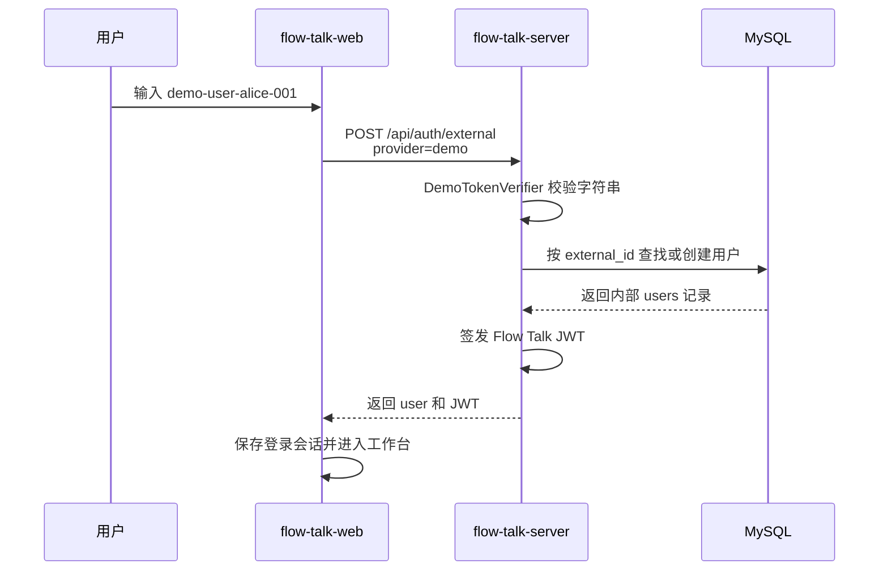

# 外部身份令牌获取与使用

## 先说结论

`flow-talk-web` 登录页中的“外部身份令牌”目前用于本地开发和联调。

当前前端固定使用 `demo` provider，服务端不会向第三方平台请求或校验令牌。因此在本地环境中，不需要先去某个网站获取 Token：直接输入一个自定义的、非空的稳定字符串即可，例如：

```text
demo-user-alice-001
```

点击“使用外部身份登录”后，服务端会把这个字符串当作 demo 外部用户的稳定身份标识，自动创建或找到对应的内部用户，然后签发 Flow Talk 自己的 JWT。

> `demo` provider 仅用于开发测试。它只检查字符串是否非空和是否超长，不具备真实的身份认证能力，不能用于生产环境。

## 一、在 Web 页面中使用

1. 打开前端登录页：`http://localhost:5173/login`。
2. 找到“外部身份令牌”输入框。
3. 输入一个便于识别且保持稳定的字符串，例如 `demo-user-alice-001`。
4. 点击“使用外部身份登录”。
5. 登录成功后，前端会保存服务端返回的 Flow Talk JWT，并进入聊天工作台。

建议不同测试用户使用不同字符串：

```text
demo-user-alice-001
demo-user-bob-001
demo-user-charlie-001
```

同一个字符串重复登录时，会进入同一个外部用户；更换字符串则会创建另一个外部用户。

## 二、Token 的规则

规则定义在 [`models/auth_provider.go`](../models/auth_provider.go) 的 `DemoTokenVerifier.Verify` 中。

当前规则如下：

| 规则 | 说明 |
| --- | --- |
| 不能为空 | 去除首尾空格后必须有内容 |
| 最大长度 | 不超过 96 个 Unicode 字符 |
| 无签名要求 | 不校验 JWT、签名、有效期或发行方 |
| 稳定映射 | 相同 Token 始终映射到相同 `external_id` |
| 仅支持 `demo` | 当前服务端只注册了 `demo` provider |

为避免生成的用户名发生冲突，推荐 Token 只使用：

```text
英文字母 + 数字 + 连字符或下划线
```

例如：

```text
qa-user-001
developer_li_01
external-demo-bob
```

不建议在 Token 中使用空格、冒号或 `@`。这些字符在生成内部用户名时都会被替换为下划线，不同 Token 可能因此生成相同用户名。

## 三、外部用户如何映射到内部用户

假设在输入框中填写：

```text
demo-user-alice-001
```

服务端会生成如下外部用户资料：

| 内部字段 | 生成结果 |
| --- | --- |
| `external_id` | `demo:demo-user-alice-001` |
| `username` | `demo_demo-user-alice-001` |
| `nickname` | `demo_demo-user-alice-001` |
| `auth_source` | `external` |
| `password` | 空，不支持本地密码登录 |

映射及同步逻辑位于：

- [`models/auth_provider.go`](../models/auth_provider.go)：校验 demo Token 并生成外部用户资料。
- [`models/external_user_model.go`](../models/external_user_model.go)：通过 `external_id` 查找或创建内部 `users` 记录。
- [`controllers/external_auth_controller.go`](../controllers/external_auth_controller.go)：签发 Flow Talk JWT 并返回给前端。

`external_id` 是外部身份和 Flow Talk 内部用户的稳定关联键。消息、会话、群成员、设备等业务仍然统一使用内部 `users.id`。

## 四、接口调用示例

也可以不经过前端页面，直接调用后端接口验证：

```bash
curl -X POST http://127.0.0.1:8080/api/auth/external \
  -H "Content-Type: application/json" \
  -d '{"provider":"demo","access_token":"demo-user-alice-001"}'
```

成功响应示例：

```json
{
  "code": 200,
  "data": {
    "user": {
      "id": 15,
      "external_id": "demo:demo-user-alice-001",
      "username": "demo_demo-user-alice-001",
      "nickname": "demo_demo-user-alice-001",
      "auth_source": "external",
      "status": 1
    },
    "token": "flow-talk-jwt"
  },
  "message": "登录成功"
}
```

这里返回的 `data.token` 才是 Flow Talk 业务接口和 WebSocket 使用的 JWT：

```text
Authorization: Bearer <flow-talk-jwt>
```

```text
ws://127.0.0.1:8080/api/ws?token=<flow-talk-jwt>&device_id=<device_id>
```

不要把输入框中的 demo Token 直接放到上述 Authorization 请求头或 WebSocket 地址中。

## 五、前后端调用流程



前端调用代码位于：

- [`flow-talk-web/app/pages/login/hooks/use-login-form-hook.ts`](../../flow-talk-web/app/pages/login/hooks/use-login-form-hook.ts)：读取输入值，并固定提交 `provider: "demo"`。
- [`flow-talk-web/app/api/data-external-login/index.ts`](../../flow-talk-web/app/api/data-external-login/index.ts)：调用 `POST /api/auth/external`。

## 六、常见问题

### 1. 提示“请输入外部身份令牌”

输入内容为空，或只有空格。填写任意非空测试标识即可。

### 2. 返回“参数校验失败”

常见原因：

- `access_token` 为空；
- Token 超过 96 个字符；
- 请求中的 `provider` 不是 `demo`；
- JSON 请求缺少 `provider` 或 `access_token`。

### 3. 返回“用户名已存在”

两个不同 Token 可能在字符替换后生成了相同的内部用户名。例如空格、冒号和 `@` 都会转换为 `_`。

换成仅包含字母、数字、连字符和下划线的唯一 Token，例如：

```text
demo-user-alice-002
```

### 4. 同一个 Token 为什么一直登录到同一个账号？

这是预期行为。服务端使用 `demo:<access_token>` 作为稳定 `external_id`。相同 Token 会查询到同一条内部用户记录。

### 5. 外部用户能否使用账号密码登录？

不能。demo 外部用户的密码为空，应继续使用同一个外部身份 Token 登录。

### 6. 输入框中的 Token 和接口返回的 Token 有什么区别？

| Token | 当前来源 | 用途 |
| --- | --- | --- |
| 外部身份 Token | 本地 demo 模式下由开发者自行填写 | 只用于调用 `/api/auth/external` 换取 IM JWT |
| Flow Talk JWT | `flow-talk-server` 签发 | 调用会话、消息、设备、资源接口和连接 WebSocket |

## 七、接入真实身份平台后如何获取

接入真实用户中心、企业 SSO 或 OAuth 后，外部身份 Token 不再由用户随意填写，而应由真实身份系统签发。标准流程是：

```text
1. 前端跳转或调用真实身份平台的登录接口
2. 身份平台完成账号密码、扫码或 OAuth 登录
3. 身份平台向前端返回 access_token
4. 前端把 access_token 和固定 provider 传给 /api/auth/external
5. flow-talk-server 调身份平台校验 Token 并获取可信用户资料
6. flow-talk-server 同步内部用户并签发自己的 JWT
7. 后续聊天接口只使用 Flow Talk JWT
```

真实接入需要修改的主要位置：

1. 在 [`models/auth_provider.go`](../models/auth_provider.go) 实现新的 `TokenVerifier`。
2. 把新 provider 加入服务端白名单，不能接受客户端传入任意校验地址。
3. 在 verifier 中调用真实身份平台的用户信息接口，并设置超时。
4. 前端先完成真实平台登录，再将获得的 access token 交给 `/api/auth/external`。
5. 移除或仅在开发环境显示手工输入 demo Token 的入口。

完整设计见 [用户管理服务接入方案](./用户管理服务接入.md)。

## 八、安全提醒

- `demo` provider 不校验身份，禁止在生产环境开放。
- 真实 access token 和 Flow Talk JWT 都不能打印到日志或提交到代码仓库。
- 生产环境应通过 HTTPS/WSS 传输 Token。
- 服务端必须自行向身份平台校验 Token，不能信任前端直接提交的用户 ID、昵称或头像。
- provider 必须是服务端维护的白名单。
- Flow Talk 不应把真实外部 access token 保存到数据库。
