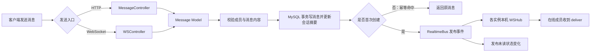

# Flow Talk Server 项目学习指南

本文面向第一次阅读 `flow-talk-server` 源码的开发者，目标是帮助你快速建立三个认识：项目如何分层、一次业务请求会经过哪些文件、核心即时通讯流程如何串起来。

建议先启动项目并调用一两个接口，再按本文的阅读顺序进入源码。项目能力和接口全集可配合阅读 [项目总览](./OVERVIEW.md) 与 [OpenAPI](./openapi.json)。

## 一、目录结构说明

```text
flow-talk-server/
├── main.go                         服务入口：加载配置、初始化依赖、注册路由、启动 Gin
├── Makefile                        开发、测试、构建和打包命令
├── go.mod / go.sum                 Go 模块及依赖版本
├── tools.go                        开发工具依赖声明
├── runner.conf                     fresh 热重载配置
├── conf/
│   └── app.ini                     MySQL、HTTP、JWT、Redis 配置
├── routers/
│   └── router.go                   全部 HTTP/WebSocket 路由及依赖组装
├── middlewares/
│   ├── auth.go                     JWT 签发、校验、当前用户注入
│   ├── body_limit.go               普通请求及特殊接口的请求体大小限制
│   └── cors.go                     浏览器跨域配置
├── controllers/
│   ├── auth_controller.go          注册、登录、当前用户
│   ├── external_auth_controller.go 外部身份登录
│   ├── user_controller.go          用户列表
│   ├── conversation_controller.go  单聊、群聊创建及会话查询
│   ├── group_controller.go         群资料、成员和角色管理
│   ├── message_controller.go       消息发送、历史消息、会话已读
│   ├── message_search_controller.go 消息搜索
│   ├── message_receipt_controller.go 单条消息已读/未读回执
│   ├── ws_controller.go            WebSocket 连接、事件处理和实时投递
│   ├── presence_controller.go      单个或批量在线状态查询
│   ├── device_controller.go        设备上报、查询和删除
│   └── resource_controller.go      图片、视频上传入口
├── models/
│   ├── database.go                 配置结构、MySQL/Redis 初始化与关闭
│   ├── user_model.go               用户持久化、注册和本地登录规则
│   ├── external_user_model.go      外部用户同步与登录
│   ├── auth_provider.go            外部身份提供方抽象和 demo 实现
│   ├── conversation_model.go       会话、成员、群权限和未读状态
│   ├── message_model.go            消息事务、幂等、历史消息和已读游标
│   ├── message_search_model.go     会话内及当前用户全部消息搜索
│   ├── message_receipt_model.go    单条消息回执持久化
│   ├── ws_hub.go                   本进程 WebSocket 连接注册与投递
│   ├── ws_event.go                 WebSocket 事件信封及 payload 定义
│   ├── realtime_bus.go             内存/Redis 实时事件总线
│   ├── presence_model.go           在线状态查询抽象
│   ├── redis_presence_store.go     Redis 在线连接快照
│   ├── device_model.go             用户设备持久化
│   └── resource_model.go           文件类型校验、落盘及头像规范化
├── responses/
│   └── response.go                 统一成功、失败和中断响应
├── docs/
│   ├── 数据库/                     建表 SQL、表关系和落地说明
│   ├── OVERVIEW.md                 项目能力与架构总览
│   ├── openapi.json                接口契约
│   └── ...                         部署、前端接入、资源存储等专题文档
└── static/                         本地上传资源目录
```

### 分层职责

| 层级 | 主要职责 | 阅读时重点 |
| --- | --- | --- |
| `main` | 创建和启动应用 | 依赖初始化顺序、资源关闭 |
| `routers` | URL 与处理器绑定、依赖组装 | 哪些接口需要鉴权、Controller 拿到了哪些依赖 |
| `middlewares` | 鉴权、跨域、请求限制等横切逻辑 | 请求进入 Controller 前发生了什么 |
| `controllers` | 参数绑定、当前用户读取、调用 Model、响应及实时事件编排 | HTTP/WebSocket 协议如何映射到业务函数 |
| `models` | 业务规则、权限校验、事务、数据库访问和实时基础设施 | 真正的业务约束和数据一致性如何实现 |
| `responses` | 统一响应结构 | 成功和错误怎样返回给客户端 |

项目采用偏轻量的 Gin MVC 结构，没有额外的 service/repository 层。因此不要只把 `models` 理解为数据库实体：它同时承担领域规则、事务和基础设施适配职责。

## 二、推荐阅读顺序

### 第一步：理解服务如何启动

按下面的顺序阅读：

1. [`main.go`](../main.go)：掌握“读取配置 → 初始化 MySQL/Redis → 创建 Gin → 注册路由 → 启动服务”的主线。
2. [`models/database.go`](../models/database.go)：理解 `AppConfig`、配置校验、连接创建和关闭。
3. [`conf/app.ini`](../conf/app.ini)：把配置结构与代码字段对应起来。
4. [`routers/router.go`](../routers/router.go)：查看完整接口分组，以及 `WSHub`、`RealtimeBus`、`PresenceProvider` 的组装方式。

读完后应能回答：Redis 关闭时项目使用什么实现？JWT 配置在哪里进入鉴权和登录流程？WebSocket Hub 在哪里创建？

### 第二步：理解标准 HTTP 请求链路

选择一个需要登录的简单接口，例如 `GET /api/me`，按下面的顺序阅读：

1. [`routers/router.go`](../routers/router.go)：接口绑定与 `AuthRequired` 挂载。
2. [`middlewares/auth.go`](../middlewares/auth.go)：解析 Bearer Token、验签、查询用户、写入 Gin Context。
3. [`controllers/auth_controller.go`](../controllers/auth_controller.go)：从 Context 读取当前用户并返回结果。
4. [`responses/response.go`](../responses/response.go)：统一响应格式。

标准请求链可以概括为：

```text
客户端请求 → Gin 路由 → 中间件 → Controller → Model → MySQL/Redis → Response
```

### 第三步：按业务流程阅读核心代码

下面各节给出业务入口与文件阅读顺序。阅读 Controller 时先关注公开方法，阅读 Model 时重点关注权限判断、事务边界和错误返回。

## 三、业务流程与文件阅读梳理

### 1. 用户注册、登录与鉴权

#### 本地注册

```text
POST /api/auth/register
→ AuthController.Register
→ models.CreateLocalUser
→ NormalizeAvatarBase64
→ users 表
→ GenerateToken
```

阅读顺序：

1. [`routers/router.go`](../routers/router.go)：注册接口不挂鉴权，但使用单独的较大请求体限制。
2. [`controllers/auth_controller.go`](../controllers/auth_controller.go)：请求参数、错误映射和 Token 返回。
3. [`models/user_model.go`](../models/user_model.go)：用户名检查、明文密码写入和登录比较。
4. [`models/resource_model.go`](../models/resource_model.go)：Base64 头像格式及大小校验。
5. [`middlewares/auth.go`](../middlewares/auth.go)：`GenerateToken` 的 JWT 内容与签名方式。

#### 本地登录与后续鉴权

```text
POST /api/auth/login → LoginUser → 明文密码比较 → GenerateToken
后续请求 → AuthRequired → VerifyToken → FindUserByID → CurrentUser
```

重点理解：JWT 通过后仍会查询数据库，因此禁用用户持有旧 Token 也不能继续访问接口。

#### 外部身份登录

阅读顺序：

1. [`controllers/external_auth_controller.go`](../controllers/external_auth_controller.go)
2. [`models/auth_provider.go`](../models/auth_provider.go)：`TokenVerifier` 抽象和 demo provider。
3. [`models/external_user_model.go`](../models/external_user_model.go)：按 `external_id` 查找或同步内部用户。

### 2. 创建单聊与群聊

#### 创建或获取单聊

```text
POST /api/conversations/direct
→ ConversationController.CreateDirect
→ GetOrCreateDirectConversation
→ BuildDirectKey
→ conversations + conversation_members
```

阅读重点：

- [`controllers/conversation_controller.go`](../controllers/conversation_controller.go)：参数和当前用户如何传入 Model。
- [`models/conversation_model.go`](../models/conversation_model.go)：`direct_key` 如何稳定排序两个用户 ID，以及并发创建时如何避免重复单聊。

#### 创建群聊

```text
POST /api/conversations/groups
→ ConversationController.CreateGroup
→ CreateGroupConversation
→ 创建 group 会话
→ 写入 owner 和初始成员
→ 发布 conversation.changed
```

继续阅读 [`controllers/ws_controller.go`](../controllers/ws_controller.go) 中的会话变化发布函数，理解创建完成后在线客户端为何能刷新会话列表。

### 3. 会话列表、详情与未读数

阅读顺序：

1. [`controllers/conversation_controller.go`](../controllers/conversation_controller.go)：`Index` 和 `Show`。
2. [`models/conversation_model.go`](../models/conversation_model.go)：
   - `ListConversations` 批量读取会话摘要、最后消息和未读数；
   - `GetConversationDetail` 校验成员身份并读取成员；
   - `GetConversationUnreadState` 生成未读数量和版本。
3. [`models/message_model.go`](../models/message_model.go)：`MarkConversationRead` 如何推进成员的已读游标。

这里要区分两个概念：

- 会话级已读游标保存在 `conversation_members.last_read_message_id`，用于快速计算未读数。
- 单条消息回执保存在 `message_receipts`，用于展示某条消息具体有哪些人已读。

### 4. 群资料、成员与角色管理

所有群管理入口在 [`controllers/group_controller.go`](../controllers/group_controller.go)，核心规则在 [`models/conversation_model.go`](../models/conversation_model.go)。

| 业务 | Controller 方法 | Model 方法 |
| --- | --- | --- |
| 修改群资料 | `UpdateProfile` | `UpdateGroupProfile` |
| 添加成员 | `AddMembers` | `AddGroupMembers` |
| 移除成员 | `RemoveMember` | `RemoveGroupMember` |
| 退出群聊 | `Leave` | `LeaveGroup` |
| 调整成员角色 | `UpdateMemberRole` | `UpdateMemberRole` |

推荐重点阅读 `CanManageGroupMember` 以及各写操作中的事务。Model 会区分 owner、admin、member，并阻止群主直接退出或管理员越权操作。

群成员变化成功后，Controller 会发布 `conversation.changed`，让受影响用户的在线客户端重新拉取权威会话快照。

### 5. HTTP 消息发送、幂等与历史消息

阅读顺序：

1. [`controllers/message_controller.go`](../controllers/message_controller.go)：`Create`、`Index`、`MarkRead` 三个入口。
2. [`models/message_model.go`](../models/message_model.go)：重点阅读 `SendMessageWithResult`。
3. [`controllers/ws_controller.go`](../controllers/ws_controller.go)：消息写入后如何发布投递和未读变化事件。

`SendMessageWithResult` 是消息业务的核心：

1. 校验消息类型和 `content`。
2. 确认发送者是 active 会话成员。
3. 使用 `(sender_id, client_msg_id)` 查询幂等消息。
4. 在事务内写入消息并推进会话最后消息摘要。
5. 返回消息及“是否首次创建”标记。

只有首次创建的消息才发布实时事件；HTTP 重试命中同一个 `client_msg_id` 时不会重复投递。

历史消息通过 `before_id` 游标向前分页，避免页码分页在新消息不断写入时产生跳行或重复。

### 6. WebSocket 建连、发送与实时投递

阅读顺序：

1. [`controllers/ws_controller.go`](../controllers/ws_controller.go)：`Connect`、`readLoop`、`writeLoop`、`handleEvent`、`handleMessageSend`。
2. [`models/ws_event.go`](../models/ws_event.go)：事件类型和统一信封。
3. [`models/ws_hub.go`](../models/ws_hub.go)：连接注册、注销、用户多连接和发送队列。
4. [`models/realtime_bus.go`](../models/realtime_bus.go)：内存总线与 Redis Pub/Sub 实现。
5. [`models/redis_presence_store.go`](../models/redis_presence_store.go)：多实例在线状态快照。

关键认识：

- WebSocket `message.send` 和 HTTP 发送最终都调用同一个消息 Model，业务规则不会分叉。
- `WSHub` 永远只管理本机真实连接。
- 单实例时 Memory RealtimeBus 直接回调本机投递。
- 多实例时 RedisRealtimeBus 发布事件，每个实例订阅后只向自己的连接投递。
- 离线用户不保存 WebSocket 消息队列；重新上线后依靠 MySQL 中的会话、未读数和历史消息补齐。

### 7. 在线状态与设备

在线状态阅读路径：

```text
WebSocket Connect/Close/Heartbeat
→ PresenceTracker
→ Hub 或 Redis 在线快照
→ presence.changed
→ PresenceController 查询
```

涉及文件：

- [`controllers/presence_controller.go`](../controllers/presence_controller.go)
- [`models/presence_model.go`](../models/presence_model.go)
- [`models/redis_presence_store.go`](../models/redis_presence_store.go)
- [`models/ws_hub.go`](../models/ws_hub.go)

设备记录阅读路径：

- [`controllers/device_controller.go`](../controllers/device_controller.go)
- [`models/device_model.go`](../models/device_model.go)

当前一个用户只保留一条设备 JSON。设备表记录“客户端自报信息与最近活跃时间”，在线状态则来自当前 WebSocket 连接，两者不要混为一谈。

### 8. 消息搜索与单条回执

消息搜索：

- [`controllers/message_search_controller.go`](../controllers/message_search_controller.go)
- [`models/message_search_model.go`](../models/message_search_model.go)

会话内搜索先校验当前用户是 active 成员；全局搜索只查询当前用户仍为 active 成员的会话。当前仅搜索文本消息的 `content.text`。

单条回执：

- [`controllers/message_receipt_controller.go`](../controllers/message_receipt_controller.go)
- [`models/message_receipt_model.go`](../models/message_receipt_model.go)

回执写入前会确认用户有权访问消息所在会话。重复标记使用 upsert，避免生成重复记录。

### 9. 资源上传

阅读顺序：

1. [`routers/router.go`](../routers/router.go)：上传接口和静态目录暴露方式。
2. [`controllers/resource_controller.go`](../controllers/resource_controller.go)：multipart 参数读取和错误返回。
3. [`models/resource_model.go`](../models/resource_model.go)：扩展名、文件签名、大小和落盘路径校验。
4. [图片、视频等资源存放](./图片、视频等资源存放.md)：客户端访问约定。

不要只依赖上传文件名判断类型；Model 同时检查扩展名与文件头签名。

## 四、简单流程图：发送一条消息



这张图体现了项目最重要的设计：HTTP 与 WebSocket 只是在入口层不同，持久化和业务校验复用同一个消息 Model；MySQL 是最终状态，实时总线负责增量通知。

## 五、带着问题阅读源码

按下面的问题做一次源码走查，可以确认是否真正理解项目：

1. 为什么同一条消息通过 WebSocket 超时后再用 HTTP 重试，不会产生两条记录？
2. 为什么单聊需要 `direct_key`，它如何避免 `A-B` 和 `B-A` 被视为两个会话？
3. 为什么 JWT 验签通过后还需要查询用户表？
4. 群管理员为什么不能移除另一个管理员？权限判断位于哪里？
5. Redis 开启后，为什么仍然需要每个实例自己的 `WSHub`？
6. 会话未读数和单条消息回执分别存在哪里、解决什么问题？
7. 慢 WebSocket 连接的发送队列满时会发生什么？客户端如何恢复最终状态？

## 六、建议的动手练习

1. 从注册开始，用接口工具完成“注册 → 登录 → 创建单聊 → 发送消息 → 拉取历史 → 标记已读”。
2. 在 `SendMessageWithResult` 的首次创建和幂等命中分支打日志，用同一 `client_msg_id` 连续请求两次。
3. 同时打开两个客户端账号，观察 `message.deliver`、`conversation.unread.changed` 和 `presence.changed`。
4. 创建一个三人群聊，分别以 owner、admin、member 身份调用群管理接口，验证权限矩阵。
5. 关闭 Redis 运行一次，再启用 Redis 运行一次，对照 `routers/router.go` 中依赖实现的变化。

完成这些练习后，再阅读测试文件和数据库文档：

- `controllers/*_test.go`：协议层和 WebSocket 行为。
- `models/*_test.go`：业务规则、DTO 和实时总线行为。
- [`docs/数据库`](./数据库)：把 Model 中的字段、索引和事务与真实表结构对应起来。
